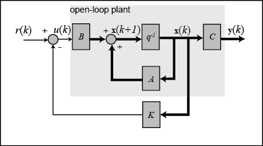

# Modelling Overview

A system can be described as one of the followings:

- Differential equation
- Difference Equation
- Transfer Function
- State Space

## Differential Equation
\begin{aligned}
\ddot{x} + \dot{x} &= ax + b \\\\
y &= x
\end{aligned}

## Difference Equation
$$
x_{t} = ax_{t-1} + b
$$

## Transfer Function
- Polynomial
$$
Y(s) = \frac{a_m s^m + ... + a_0}{b_n s^n + ... + b_0}
$$

- Poles and Zeros
$$
Y(s) = K \frac{(s-z_m)...(s-z_0)}{(s - p_n) ... (s-p_0)}
$$

## State Space

$$
\begin{align}
\dot{x}(t) &= Ax(t) + Bu(t) \\\\
y(t) &= Cx(t) + Du(t)
\end{align}
$$

- **x** as the state vector,
- **A** as the system matrix (square, N x N for N states),
- **B** as the input matrix (N rows x 1 column for a single-input, single output (SISO) system,
- **C** as the output matrix (one row x N columns for a SISO system),
- **D** as the feedforward matrix (1 x 1 for a SISO system).

- **(*)** The poles of the transfer function are the eigenvalues of the system matrix **A**

### Matlab Code
`sys = ss(a,b,c,d)`

`sys = ss(a,b,c,d,Ts)`

`sys_ss = ss(sys)`

## Matlab functions
### Transfer Function
`s = tf('s')`

`feedback(G(s), H(s))`

`G = zpk(sys)`

`G = zpk([1],[1],[1])`

### Poles and Zeros
Find poles of a SISO or MIMO system: `pole(sys)`

`pzplot(sys)`

### State Space

### System Analysis
`linearSystemAnalyzer(G,T1,T2)`

`step(sys)`

## Reference
[1] http://ctms.engin.umich.edu/CTMS/index.php?example=InvertedPendulum&section=ControlDigital
