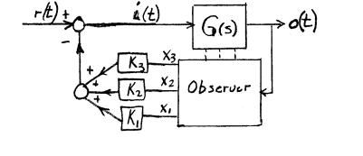

# 状态空间法


State space model is in time domain and can describe both SISO and MIMO systems.

Some advantages:

- Numerically simple, easy for computers.
- Transfer function only deals with input/output behavior, while state-space can assess internal features of the system.
- MIMO and system coupling

Controller Design:

- Full-state feedback (pole placement)
- Observer / estimator design: estimating the system state from available measurements.
- Dynamic output feedback: combines these two with provable guarantees on stability and performance.

Overall, state-space design process is more systematic than classical control design.


## Controllability


## Observability


## Calculate Gain


For a SISO system, the transfer function can take the forms: $H(s) = [C(sI-A)^{-1}B + D]$ and $H(z) = [C(zI-A)^{-1}B + D]$.

The new input can be calculated as:
$$
u(t) = r(t) - KX = r(t) - \begin{pmatrix}k_1 & k_2 & k_3\end{pmatrix}
\begin{pmatrix} x_1 \\\\ x_2 \\\\ x_3 \end{pmatrix}
$$

This resulted in a new state equation for the closed-loop system:
$$
\frac{dx}{dt} = [A - BK]x - Br(t)
$$


## Matlab code for LQR

```matlab
A = sys_d.a;
B = sys_d.b;
C = sys_d.c;
D = sys_d.d;
Q = C'*C            % state-cost matrix
R = 1;              % control-cost
[K] = dlqr(A,B,Q,R) % control gain matrix

Ac = [(A-B*K)];
Bc = [B];
Cc = [C];
Dc = [D];

states = {'x' 'x_dot' 'phi' 'phi_dot'};
inputs = {'r'};
outputs = {'x'; 'phi'};

sys_cl = ss(Ac,Bc,Cc,Dc,Ts,'statename',states,'inputname',inputs,'outputname',outputs);

t = 0:0.01:5;
r =0.2*ones(size(t));
[y,t,x]=lsim(sys_cl,r,t);
[AX,H1,H2] = plotyy(t,y(:,1),t,y(:,2),'plot');
set(get(AX(1),'Ylabel'),'String','cart position (m)')
set(get(AX(2),'Ylabel'),'String','pendulum angle (radians)')
title('Step Response with Digital LQR Control')
```
